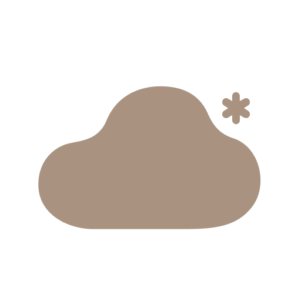

<p align="center">
  
</p>

<h1 align="center">PetSnowy for Home Assistant</h1>

<p align="center">
  Custom <a href="https://www.home-assistant.io/">Home Assistant</a> integration for local-network control of <a href="https://www.petsnowy.com/">PetSnowy</a> smart pet devices via the Tuya protocol.<br>
  No cloud dependency - all communication stays on your LAN.
</p>

<p align="center">
  <a href="https://github.com/hypercubian/ha-petsnowy/releases"></a>
  <a href="https://github.com/hypercubian/ha-petsnowy/releases"></a>
  <a href="https://github.com/hypercubian/ha-petsnowy/stargazers"></a>
  <a href="LICENSE"></a>
</p>
<p align="center">
  <a href="https://hacs.xyz/"></a>
  
  <a href="https://github.com/hypercubian/ha-petsnowy/actions/workflows/ci.yml"></a>
  <a href="https://github.com/psf/black"></a>
  <a href="https://mypy-lang.org/"></a>
</p>

<p align="center">
  <a href="https://my.home-assistant.io/redirect/hacs_repository/?owner=hypercubian&repository=ha-petsnowy&category=integration">
    
  </a>
</p>

<br>
<br>
<br>

<p align="right">
  <a href="https://github.com/hypercubian"></a>
</p>

---

## Supported Devices

| Device | Product Name | Model | Protocol | Description |
|--------|-------------|-------|----------|-------------|
| **Self-Cleaning Litter Box** | SNOW+ Automatic Self-Cleaning Litter Box | PS-001 | 3.4 | Smart litter box with auto-clean, deodorization, cat weight tracking, and safety sensors |
| **Water Fountain** | SNOW+ Automatic Pet Water Fountain | PS-010 | 3.3 | Filtered water fountain with normal/night modes and pump monitoring |
| **OilClear AI Water Fountain** | OilClear A.I Series Wireless Weight-Sensing Pet Fountain | PS-120 | Cloud | Battery/weight-sensing fountain with heater, water temp, and filter/pump reset. Cloud-polled (see note). |
| **Air Purifier** | PETSNOWY Pet Air Purifier | - | 3.4 | TVOC-sensing air purifier with 6-speed fan, ionizer, and auto-off timer |
| **Pet Feeder** | SNOW+ Automatic Pet Feeder | PS-020 | 3.3 | Automatic feeder with food level detection and on-demand dispensing |

> **Note:** All devices use the local Tuya protocol except the **OilClear AI Water Fountain**, which is power-managed and drops its LAN listener between syncs — so it's polled via the **Tuya Cloud API** instead. Setup asks for your Tuya IoT project's Access ID, Access Secret, and region rather than an IP/local key.

## Installation

### HACS (Recommended)

> **Don't have HACS?** Follow the [official HACS installation guide](https://hacs.xyz/docs/use/download/download/) first, then [activate the integration](docs/hacs-setup.md).

1. Open HACS in your Home Assistant instance
2. Go to **Integrations** > three-dot menu > **Custom repositories**
3. Add `https://github.com/hypercubian/ha-petsnowy` with category **Integration**
4. Search for "PetSnowy" and install
5. Restart Home Assistant

### Manual

1. Copy the `custom_components/petsnowy` directory into your Home Assistant `config/custom_components/` folder
2. Restart Home Assistant

## Configuration

1. Go to **Settings** > **Devices & Services** > **Add Integration**
2. Search for **PetSnowy**
3. Select your device type (Litterbox, Fountain, OilClear Fountain, Purifier, or Feeder)
4. Enter credentials for your device:
   - **Local devices** (all except OilClear): Device ID, IP Address, Local Key, and Protocol Version (auto-filled 3.3/3.4)
   - **OilClear** (cloud): Device ID, Data-centre Region, and your Tuya IoT **Access ID** and **Access Secret**

The integration validates connectivity before completing setup.

### Obtaining Tuya Credentials

You need the Device ID, IP address, and Local Key for each device. These can be obtained using the [tinytuya](https://github.com/jasonacox/tinytuya) wizard:

```bash
pip install tinytuya
python -m tinytuya wizard
```

Follow the wizard prompts - you'll need a [Tuya IoT Platform](https://iot.tuya.com/) account linked to your PetSnowy app account.

## Entities

### SNOW+ Self-Cleaning Litter Box (PS-001)

| Platform | Entities |
|----------|----------|
| **Sensor** | Cat weight (g), excretion count today, excretion duration today (s), filter days remaining, status (standby/cleaning/deodorization/sleep) |
| **Binary Sensor** | Top cover fault, drawer fault, drawer full, cat stuck, check fault, cat stayed too long, trouble removal |
| **Switch** | Auto clean, sleep mode, indicator light, child lock, auto deodorize |
| **Button** | Clean, deodorize, empty litter, cancel empty, pause, resume, reset filter, calibrate weight |
| **Number** | Clean delay (2–60 min, step 2) |

### SNOW+ Water Fountain (PS-010)

| Platform | Entities |
|----------|----------|
| **Sensor** | Filter days, pump cleaning days |
| **Switch** | Power, indicator light |
| **Button** | Reset filter, reset pump |
| **Number** | Filter reminder (0–90 days) |
| **Select** | Work mode (normal/night) |

### OilClear AI Water Fountain (PS-120) — cloud-polled

| Platform | Entities |
|----------|----------|
| **Sensor** | Water weight (g), water temperature (°C), battery (%), filter days remaining, pump cleaning days, charge status (diagnostic) |
| **Switch** | Power, heating, indicator light |
| **Button** | Reset filter, reset pump, calibrate weight |
| **Number** | Filter reminder (0–30 days) |
| **Select** | Work mode (normal/night) |

### PETSNOWY Air Purifier

| Platform | Entities |
|----------|----------|
| **Sensor** | TVOC (µg/m³), filter days, countdown remaining (min) |
| **Binary Sensor** | Hall sensor fault, toppled over, fan fault, filter missing |
| **Switch** | Power, ionizer |
| **Select** | Mode (auto/sleep), fan speed (1–6), auto-off countdown (off/1h–5h) |

### SNOW+ Pet Feeder (PS-020)

| Platform | Entities |
|----------|----------|
| **Sensor** | Food status (enough/insufficient) |
| **Binary Sensor** | Cover (opening detection) |
| **Button** | Quick feed (1 portion) |

## Technical Details

- **Communication:** Local Tuya protocol via [tinytuya](https://github.com/jasonacox/tinytuya) - no cloud polling
- **Connection:** Persistent TCP with automatic reconnection on errors
- **Polling:** 30-second update interval via `DataUpdateCoordinator`
- **Library:** [petsnowy-py](https://github.com/hypercubian/petsnowy-py) - async Python library for PetSnowy devices

## Contributing

1. Clone the repo
2. Install dependencies: `poetry install`
3. Install pre-commit hooks: `poetry run pre-commit install`
4. Run tests: `poetry run pytest tests/unit/`

## License

[MIT](LICENSE)
